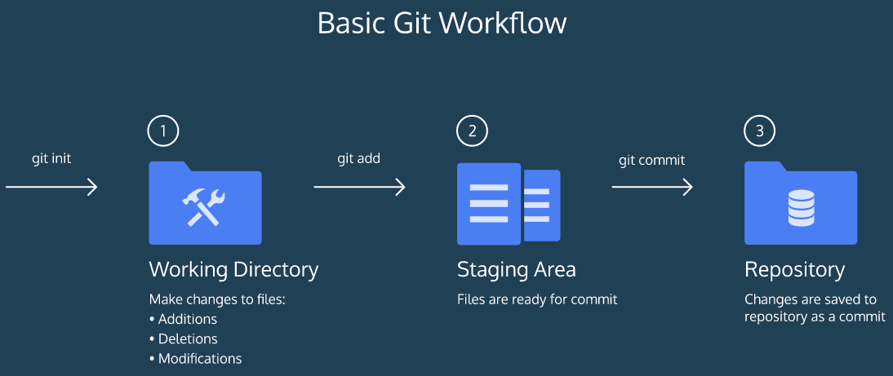
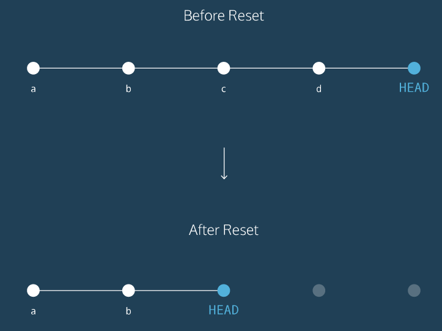

This is a basic git tutorial made exclusively for first year SMVDU students.  
### DEFINITION
Git is a software that allows you to keep track of changes made to a project over time. Git works by recording the changes you make to a project, storing those changes, then allowing you to reference them as needed.  
#### Setting your username in Git  
**1.**  Open Terminal  
**2.**`$git config --global user.name "Aditya Sharma"`  
**3.** Confirm that you have set the Git username correctly:-   
```
$ git config --global user.name
  Aditya Sharma
```  
#### Setting your commit email address  
**1.** Open Terminal  
**2.** Set an email address in Git. You can use your GitHub-provided no-reply email address or any email address:-  
`$ git config --global user.email "email@example.com"`  
**3.** Confirm that you have set the email address correctly in Git:-  
```
$ git config --global user.email
  email@example.com
```
### BASIC GIT WORKFLOW  
#### Git Workflow


A git project can be divided into three parts:- 

1. **Working Directory** - This is the folder where we create, edit, delete and organize files.
2. **Staging Area** - Changes that we make in the working directory are listed here.
3. **Repository** - Git permanently stores those changes as different versions of the project.  

The Git workflow consists of editing files in the working directory, adding files to the staging area, and saving changes to a Git repository. In Git, we save changes with a commit.  
#### Git Commands  
**1.**`git init` - The word `init` means initialize. The command sets up all the tools Git needs to begin tracking changes made to the project.  
**2.**`git status` - We can check the status of the changes made to the contents of the working directory with this command.  
**3.**`git add filename` or `git add .` - Our files need to be added to the staging area in order for git to start tracking them.  
**4.**`git diff filename` - We can check the differences between the files in the working directory and the staging area with this command.  
**5.**`git commit -m "your commit message"` - A commit is the last step in our Git workflow. This permanently stores file changes from the staging area in the repository.  
Rules for commit messages :-  
- Should be brief
- Must be in quotation marks
- Written in the present tense  

**6.**`git log` - Used to refer back to an earlier version of a project.  
### BACKTRACKING IN GIT  
#### Introduction  
When working on a Git project, sometimes we make changes that we want to revert or get rid of. Git offers a few eraser-like features that allow us to undo mistakes during project creation.  
#### Git Commands  
**1.**`git show HEAD` - In Git, the commit you are currently on is known as the HEAD commit. In many cases, the most recently made commit is the HEAD commit.   
**2.**`git checkout HEAD filename` - This will restore the file in your working directory to look exactly as it did when you last made a commit.  
**3.**`git reset HEAD filename` - We can unstage files from the staging area using this command. It resets the file in the staging area to be the same as the HEAD commit. It does not discard file changes from the working directory, it just removes them from the staging area.  
**4.**`git reset commit_SHA` - This command works by using the first 7 characters of the SHA of a previous commit. `HEAD` is now set to that previous commit.  

    

### GIT BRANCHING  
#### Introduction  
Till now we worked in a single branch called `master`. Git allows us to create branches to experiment with versions of a project. We can create a new branch and make some changes to that branch only. It will have no effect on the `master` branch until we merge our new branch to the `master` branch. `new_branch` is a different version of the Git project. It contains commits from `master` but also has commits that `master` does not have.

  

#### Git Commands  
**1.**`git branch` - It is used to find the branch which you are on. The `*` shows you what branch you are on.  
**2.**`git branch new_branch` - This is used to create a new branch. Name your branch something that describes the purpose of the branch. Branch names cannot contain whitespaces.  
**3.**`git checkout branch_name` - You can switch between branches using this command. Once you switch to a branch and make commits on that branch they have no impact on `master` branch. You can continue your workflow while `master` branch stays intact.  
**4.**`git merge branch_name` - This is used to include all the changes made to the `new_branch` on the `master` branch. First switch to `master` branch and then use `git merge new_branch`.  
**5.**`git branch -d branch_name` - After a branch has been integrated into `master`, it has served its purpose and can be deleted. This command will delete the specified branch from your git project.  
### GIT COLLABORATION  
#### Introduction  
We have worked on git as a single user till now. Git offers a suite of collaboration tools to make working with others on a project easier. This is done by using `remotes`. A `remote` is a shared Git repository that allows multiple collaborators to work on the same Git project from different locations. Collaborators work on the project independently, and merge changes together when they are ready to do so. It lives outside your Git project folder. Remotes can live on the web, on a shared network or even in a separate folder on your local computer. 
#### Git Commands  
**1.**`git clone remote_location clone_name` - This command creates a copy of an existing repository to your local machine.  
Here:-  

- `remote_location` tells Git where to go to find the remote. This could be a web address, or a filepath.  
- `clone_name` is the name you give to the directory in which Git will clone the repository.  

**2.**`git remote -v` - Behind the scenes Git gives the remote address the name `origin`, so that you can refer to it more conveniently. We can see a list of a Git project’s remotes with this command.  
**3.**`git fetch` - If changes have been made to the remote then you can use this command to bring the changes down to your local copy. This command will not merge changes from the remote into your local repository. It brings those changes onto a remote branch(`origin/master`).  
**4.**`git merge origin/master` - This is used after `git fetch` to  integrate `origin/master` into your local `master` branch.  
**5.**`git push origin your_branch_name` - This pushes a local branch to the `origin` remote.  
**6.**`git remote add upstream https://github.com/ORIGINAL_OWNER/ORIGINAL_REPOSITORY.git` - This is used to specify a new remote upstream repository that will be synced with the fork. You can verify the new upstream repository you've specified for your fork using `git remote -v`.